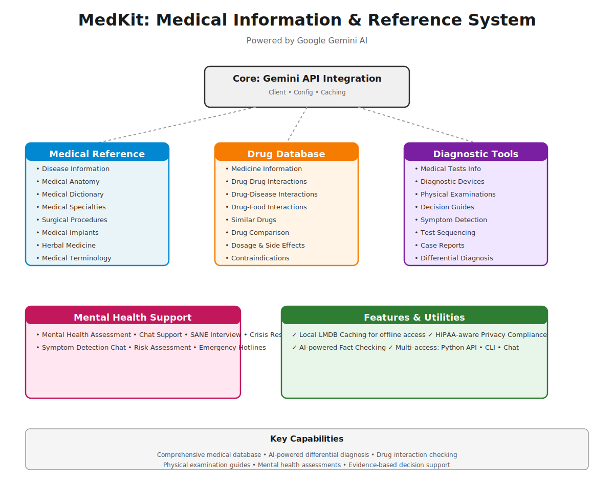

# MedKit - Medical Information and Reference System

[](https://www.python.org/downloads/)
[](https://opensource.org/licenses/MIT)
[](https://medkit.readthedocs.io)

A comprehensive **medical information and reference system** powered by Google's Gemini AI. MedKit provides programmatic access to medical knowledge, drug interactions, disease information, diagnostic tools, and clinical decision support.

## System Architecture



### Text Overview

```
┌─────────────────────────────────────────────────────────────────────────────┐
│                    MedKit: Medical Reference System                          │
│                      Powered by Google Gemini AI                             │
└─────────────────────────────────────────────────────────────────────────────┘

                         ┌──────────────────────────┐
                         │   Core Client & Config   │
                         │   (Gemini API Client)    │
                         └──────────────┬───────────┘
                                        │
        ┌───────────────────────────────┼───────────────────────────────┐
        │                               │                               │
        ▼                               ▼                               ▼
 ┌─────────────────┐           ┌─────────────────┐           ┌─────────────────┐
 │ Medical Reference│           │  Drug Database  │           │ Diagnostic Tools│
 ├─────────────────┤           ├─────────────────┤           ├─────────────────┤
 │ • Disease Info  │           │ • Medicine Info │           │ • Medical Tests │
 │ • Anatomy       │           │ • Drug-Drug     │           │ • Devices       │
 │ • Dictionary    │           │ • Drug-Disease  │           │ • Exams         │
 │ • Specialties   │           │ • Drug-Food     │           │ • Decision Guide│
 │ • Surgery       │           │ • Alternatives  │           │ • Symptom Check │
 │ • Implants      │           │ • Comparison    │           │ • Case Reports  │
 │ • Herbs         │           │                 │           │                 │
 └─────────────────┘           └─────────────────┘           └─────────────────┘

        ┌──────────────────────────────────────────────────────────────┐
        │                    Mental Health Support                     │
        ├──────────────────────────────────────────────────────────────┤
        │ • Assessments  • Chat Support  • SANE Interview  • Resources │
        └──────────────────────────────────────────────────────────────┘

┌─────────────────────────────────────────────────────────────────────────────┐
│  Utilities: LMDB Caching • Privacy Compliance • Fact Checking • Offline     │
└─────────────────────────────────────────────────────────────────────────────┘
```

## Features

### 🏥 Medical Reference
[View detailed documentation →](docs/medical_ai/)

- **Disease Information** - Comprehensive disease definitions, symptoms, causes, and treatments
- **Medical Anatomy** - Detailed anatomical structures and physiological functions
- **Medical Specialties** - Information about different medical disciplines and subspecialties
- **Surgical Procedures** - Surgical techniques, instruments, and operative procedures
- **Medical Implants** - Types and uses of medical implants and prosthetics
- **Herbal Medicine** - Evidence-based information on herbal remedies

### 💊 Drug Database
[View detailed documentation →](docs/drug_ai/)

- **Medicine Information** - Drug details, dosing, side effects, and contraindications
- **Drug-Drug Interactions** - Check interactions between medications
- **Drug-Disease Interactions** - Safety in specific conditions
- **Drug-Food Interactions** - Dietary considerations
- **Similar Drugs** - Find alternative medications
- **Drug Comparison** - Compare multiple medications side-by-side

### 🔍 Diagnostic Tools
[View detailed documentation →](docs/diagnostic_ai/)

- **Medical Tests** - Information about diagnostic tests and their purposes
- **Test Devices** - Medical diagnostic equipment and devices
- **Physical Examinations** - Comprehensive guides for 27+ body systems and physical exams
- **Symptom Detection** - AI-powered symptom analysis and differential diagnosis
- **Medical Decision Guides** - Evidence-based clinical decision trees
- **Synthetic Case Reports** - Generated medical case studies for learning

### 🧠 Mental Health
[View detailed documentation →](docs/psychology_ai/)

- **Mental Health Assessments** - Structured screening tools and assessments
- **Mental Health Chat** - Conversational mental health support interface
- **SANE Interview** - Structured clinical interview tool
- **Symptom Detection Chat** - Interactive symptom assessment

### 🛠️ Utilities
- **Local Caching** - LMDB-based caching for offline access and performance
- **Privacy Compliance** - HIPAA and privacy-aware data handling
- **Fact Checking** - AI-powered medical fact verification

## Installation

### Basic Installation

```bash
pip install git+https://github.com/csverma610/medkit.git
```

### With Development Tools

```bash
pip install git+https://github.com/csverma610/medkit.git#egg=medkit[dev]
```

### With Documentation Building

```bash
pip install git+https://github.com/csverma610/medkit.git#egg=medkit[docs]
```

### Local Development

```bash
git clone https://github.com/csverma610/medkit.git
cd medkit
pip install -e ".[dev]"
```

## Requirements

- Python 3.8+
- Google Gemini API key (get one [here](https://ai.google.dev/))

## Quick Start

### Programmatic Usage

```python
from medkit.medical.disease_info import get_disease_info
from medkit.drug.medicine_info import get_medicine_info
from medkit.drug.drug_drug_interaction import get_drug_interaction

# Get disease information
disease_info = get_disease_info("diabetes")
print(disease_info)

# Get medicine information
med_info = get_medicine_info("aspirin")
print(med_info)

# Check drug interactions
interaction = get_drug_interaction("aspirin", "ibuprofen")
print(interaction)
```

### Command-Line Usage

```bash
# Disease information
python cli/cli_disease_info.py diabetes
python cli/cli_disease_info.py "heart disease" --verbose

# Medicine information
python cli/cli_medicine_info.py aspirin
python cli/cli_medicine_info.py ibuprofen --interactions

# Medical anatomy
python cli/cli_medical_anatomy.py heart
python cli/cli_medical_anatomy.py brain --functions
```

See [cli/README.md](cli/README.md) for more CLI examples.

## Project Structure

```
medkit/
├── core/                    # Core client and configuration
│   ├── config.py           # Configuration management
│   ├── medkit_client.py    # Main MedKit client
│   └── gemini_client.py    # Google Gemini API integration
│
├── medical/                # Medical reference modules (32 files)
│   ├── disease_info.py
│   ├── medical_anatomy.py
│   ├── medical_dictionary.py
│   ├── medical_speciality.py
│   ├── medical_procedure_info.py
│   ├── surgery_info.py
│   ├── surgical_tool_info.py
│   ├── medical_implant.py
│   ├── herbal_info.py
│   ├── medical_test_graph.py
│   └── ... (more modules)
│
├── drug/                   # Drug and medicine information
│   ├── medicine_info.py
│   ├── drug_drug_interaction.py
│   ├── drug_disease_interaction.py
│   ├── drug_food_interaction.py
│   ├── similar_drugs.py
│   ├── drugs_comparison.py
│   ├── rxnorm_client.py    # RxNorm API integration
│   └── rx_med_info.py
│
├── diagnostics/            # Diagnostic tools
│   ├── medical_test_info.py
│   ├── medical_test_devices.py
│   └── medical_tests_graph.py
│
├── mental_health/          # Mental health modules
│   ├── mental_health_assessment.py
│   ├── mental_health_chat.py
│   ├── sane_interview.py
│   └── sympton_detection_chat.py
│
├── phyexams/               # Physical examination modules (27 files)
│   ├── exam_head_and_neck.py
│   ├── exam_heart.py
│   ├── exam_lungs_chest.py
│   ├── exam_neurological.py
│   └── ... (more exam modules)
│
├── utils/                  # Utility modules
│   ├── logging_config.py
│   ├── privacy_compliance.py
│   ├── lmdb_storage.py
│   └── pydantic_prompt_generator.py
│
└── vistools/               # Visualization tools
    └── visualize_decision_guide.py
```

## Configuration

Set up your Google Gemini API key:

```bash
export GOOGLE_API_KEY="your-api-key-here"
```

Or configure programmatically:

```python
from medkit.core.config import MedKitConfig

config = MedKitConfig(api_key="your-api-key")
```

## Documentation

Comprehensive documentation is available for all features and modules.

### 📚 Documentation Index

| Section | Description | Link |
|---------|-------------|------|
| **Medical Reference** | Disease info, anatomy, specialties, implants, herbal medicine | [📖 View](docs/medical_ai/) |
| **Drug Database** | Medicine info, drug interactions, dosing, alternatives | [📖 View](docs/drug_ai/) |
| **Diagnostic Tools** | Medical tests, devices, physical exams, decision guides | [📖 View](docs/diagnostic_ai/) |
| **Mental Health** | Assessments, chat, SANE interview, crisis resources | [📖 View](docs/psychology_ai/) |
| **CLI Tools** | Command-line interfaces for all modules | [📖 View](cli/README.md) |
| **API Reference** | Complete API documentation | [📖 View](docs/api/) |
| **Tutorials** | Step-by-step usage guides | [📖 View](docs/tutorials.rst) |
| **Development** | Setup for developers | [📖 View](docs/development_setup.rst) |

### Building Documentation Locally

```bash
cd docs
pip install -r ../requirements-dev.txt
make clean
make html
```

Then open `docs/_build/html/index.html` in your browser.

### Online Documentation

- [ReadTheDocs](https://medkit.readthedocs.io) (coming soon)
- API Reference: Full module and function documentation
- Tutorials: Practical examples and use cases
- Development Setup: Instructions for contributors

## Usage Examples

### Disease Information

```python
from medkit.medical.disease_info import get_disease_info

# Get comprehensive disease information
info = get_disease_info("type 2 diabetes")
print(f"Definition: {info.definition}")
print(f"Symptoms: {info.symptoms}")
print(f"Treatment: {info.treatment}")
```

### Drug Interactions

```python
from medkit.drug.drug_drug_interaction import get_drug_interaction

# Check interaction between two drugs
interaction = get_drug_interaction("aspirin", "warfarin")
print(f"Severity: {interaction.severity}")
print(f"Details: {interaction.description}")
```

### Physical Examinations

```python
from medkit.phyexams.exam_heart import examine_heart

# Get heart examination guide
exam_guide = examine_heart()
print(exam_guide.procedure)
print(exam_guide.findings)
```

### Mental Health Assessment

```python
from medkit.mental_health.mental_health_assessment import assess_mental_health

# Conduct mental health assessment
assessment = assess_mental_health(user_responses)
print(f"Risk Level: {assessment.risk_level}")
print(f"Recommendations: {assessment.recommendations}")
```

## Testing

Run the test suite:

```bash
# Install test dependencies
pip install -e ".[dev]"

# Run all tests
pytest tests/

# Run with coverage
pytest tests/ --cov=medkit

# Run specific test file
pytest tests/test_disease_info.py
```

## Development

### Code Quality

Format code with Black:
```bash
black medkit/ cli/ tests/
```

Check linting:
```bash
flake8 medkit/ cli/ tests/
```

Type checking:
```bash
mypy medkit/ cli/ tests/
```

### Contributing

1. Fork the repository
2. Create a feature branch (`git checkout -b feature/amazing-feature`)
3. Commit your changes (`git commit -m 'Add amazing feature'`)
4. Push to the branch (`git push origin feature/amazing-feature`)
5. Open a Pull Request

See [CONTRIBUTING.md](docs/contributing.rst) for detailed guidelines.

## Important Disclaimers

⚠️ **Medical Disclaimer**: This tool is for **informational purposes only** and should not be used as a substitute for professional medical advice. Always consult with qualified healthcare professionals for medical decisions.

⚠️ **Accuracy**: While MedKit strives for accuracy, medical information is constantly evolving. Verify all information with current medical literature and professional guidance.

⚠️ **Privacy**: Handle all patient data with care. Ensure compliance with HIPAA and applicable data protection regulations.

## License

This project is licensed under the MIT License - see [LICENSE](LICENSE) file for details.

## Citation

If you use MedKit in your research or project, please cite:

```bibtex
@software{medkit2024,
  title={MedKit: Medical Information and Reference System},
  author={Your Name},
  year={2024},
  url={https://github.com/csverma610/medkit}
}
```

## Acknowledgments

- Built with [Google Gemini AI](https://ai.google.dev/)
- Medical data sources: [RxNorm](https://www.nlm.nih.gov/research/umls/rxnorm/), medical literature, and clinical guidelines
- Documentation generated with [Sphinx](https://www.sphinx-doc.org/)

## Support

- 📖 [Documentation](https://medkit.readthedocs.io)
- 🐛 [Report Issues](https://github.com/csverma610/medkit/issues)
- 💬 [Discussions](https://github.com/csverma610/medkit/discussions)
- 📧 Email: youremail@example.com

## Roadmap

- [ ] Web dashboard for interactive queries
- [ ] Mobile app interface
- [ ] Integration with EHR systems
- [ ] Multilingual support
- [ ] Offline mode enhancement
- [ ] API endpoint service
- [ ] Real-time evidence updates

## Related Projects

- [BERT-Based Medical Named Entity Recognition](https://github.com/example/bert-medical-ner)
- [OpenEHR Standards Implementation](https://www.openehr.org/)
- [HL7 FHIR Standards](https://www.hl7.org/fhir/)

---

**Last Updated**: November 2024

Made with ❤️ for healthcare professionals and developers
